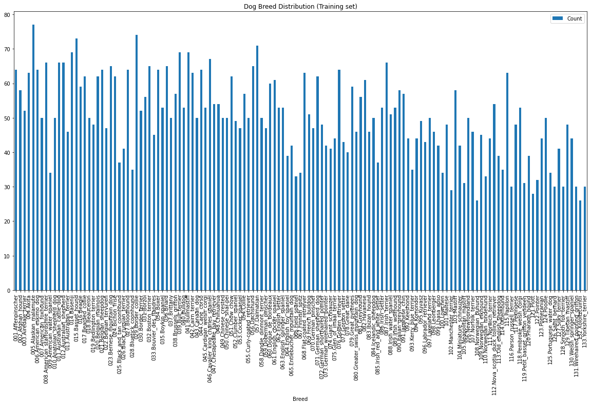
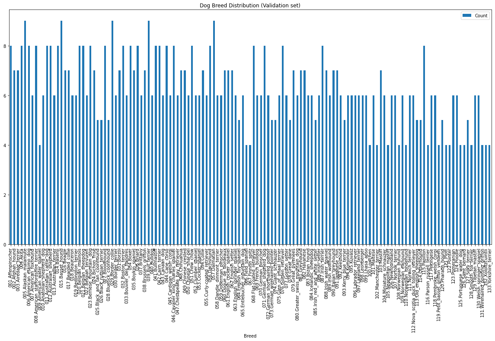
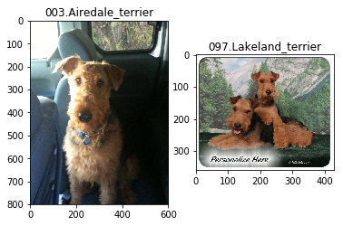
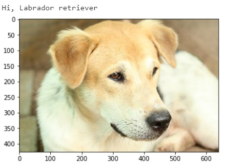
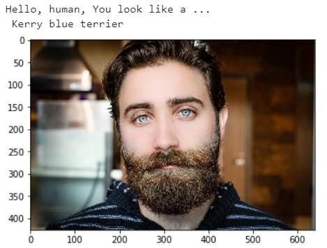
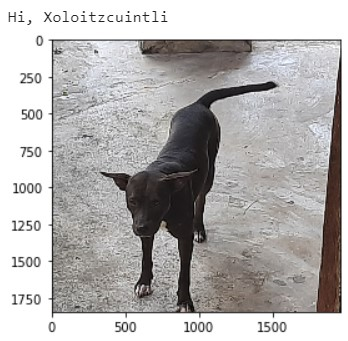
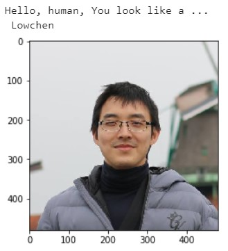
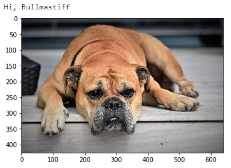
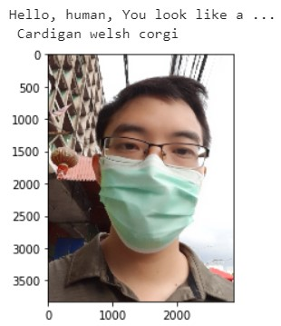

## Using Convolutional Neural Networks to Identify Dog Breeds
Thada Jirajaras  
May 31st, 2021

## I. Definition
### Project Overview
Nowadays, AI and computer vision play an important role in detecting objects [1]. There are many models pretrained with a big dataset for this task. For example, there are models that can identify objects in the ImageNet dataset which have 1000 classes [2].

However, there are limitations that these pretrained models can identify only the classes that appear in the trained dataset. For example, in order to specifically identify unseen classes like some dog breeds, the models need to be newly created. Also, there may be situations where there are only a few dog images that have the breed labels because it requires a lot of effort to label images [3]. Thus, the model must use only a few images to train.

### Problem Statement
With only a few dog images with breed labels, it is challenging to create a model that does not overfit the training set and give high accuracy on the test set.

### Metrics
Accuracy is the acceptable and selected metric because classes are not extremely unbalanced. However, one may also look at precision and recall of each classes to see performance of each class separately.


## II. Analysis
### Data Exploration
Dog dataset: (https://s3-us-west-1.amazonaws.com/udacity-aind/dog-project/dogImages.zip) This is the main dataset for developing a CNN model to identify dog breeds. The dataset contains dog images with 133 breed labels. The dataset consist of training (6680 images), validation (835 images), and test (836 images) sets. The classes are just  slightly imbalanced. 






### Exploratory Visualization

The feature required for training the model is the image itself. Due to the nature of deep learning models that will be used in this project, the features will be extracted automatically  by the models. Images just need some preprocessing steps such as resize, flip, and a little rotation to have correct format and have variety of inputs for the models.

However, there is some challenge to assign breed to dogs if the dogs look very similar to each other. For example, distinguishing between a Brittany and a Welsh Springer Spaniel is hard even by a human.

|                         **Brittany**                         |                  **Welsh Springer Spaniel**                  |
| :----------------------------------------------------------: | :----------------------------------------------------------: |
|  |  |


Curly-Coated Retrievers and American Water Spaniels also look similar. 

|                  **Curly-Coated Retriever**                  |                  **American Water Spaniel**                  |
| :----------------------------------------------------------: | :----------------------------------------------------------: |
|  |  |

Likewise, some dogs have more than one color such as Labradors. The can be yellow, chocolate, and black. Thus, the model need to consider both shape and color.

|                       Yellow Labrador                        |                      Chocolate Labrador                      |                        Black Labrador                        |
| :----------------------------------------------------------: | :----------------------------------------------------------: | :----------------------------------------------------------: |
|  |  |  |

 

### Algorithms and Techniques

In order to achieve high accuracy from fitting the model with only a few images, transfer learning must be used. Also, the chosen base models should be trained on the dataset that contain some different dog breeds. Fortunately, all base models from torchvision are trained on the ImageNet dataset which contains some image categories corresponding to dogs [2]. Thus, one of these base models will be chosen for transfer learning in this project.

### Benchmark
There are some works that use the same datasets to create and test the models [4, 5] and give the similar benchmark results. For example, Maanav Shah created 4 models including VGG-49, ResNet-50, Inception V3, and Xception [4]. The model performance comparisons of his work are as follows.

| Model        | Acc  | Training Time in seconds <br />(20 epochs, batch size = 32) |
| ------------ | ---- | ----------------------------------------------------------- |
| VGG-19       | 46%  | 24.16                                                       |
| ResNet-50    | 82%  | 18.41                                                       |
| Inception v3 | 81%  | 31.83                                                       |
| Xception     | 85%  | 49.07                                                       |


## III. Methodology
### Data Preprocessing
#### Image transformations for training set

1. Resize an image to have size (244, 244)
2. Random flip the image horizontally 
3. Apply small rotation in the range -10 to 10 degree to the image
4. Convert the image to the tensor that is the data type for the model
5. Normalize images to have the mean =[0.485, 0.456, 0.406] and std = [0.229, 0.224, 0.225] so that the model can learn from the image easier

Random flip  and rotation provide variety to the training sets and can help model to avoid overfitting issue. 

#### Image transformations for evaluation and test sets

1. Resize an image to have size (244, 244)
2. Convert the image to the tensor that is the data type for the model
3. Normalize images to have the mean =[0.485, 0.456, 0.406] and std = [0.229, 0.224, 0.225] so that the test image has the same mean and std as the trained ones.

### Implementation

ResNet-50 from torchvision.models are chosen as a pretrained model. The strong point of this model is that it can avoid vanishing gradient even for quite deep model architectures. The way to use transferred model with the new dataset is to freeze all feature layers and only allow classification layer to be trained. The steps are as follows.

1. Load the pretrained model "ResNet-50 " for the ImageNet dataset from torchvision
2. Freeze all features layers not to be trained
3. Create new classification layer to have the number of output nodes equal to the number of dog breeds which is 133
4. Train the parameters of the classification layer

After 19 epochs of training, the best model with lowest loss in validation set provides 82% of accuracy  in the test set.  Later iterations give insignificant improvement in the validation loss. Thus, some hyperparameter may be changed before continue training the model.  One possible parameter that can affect the training performance after training for some epochs is the learning rate.  Eventually, model will require lower learning rate to converge to the lower training loss.

### Refinement

Model refinement is made by reducing the learning rate from 0.001 to 0.0001. The steps are as follows. 

1. Load the best trained model 
2. Continue training with lower learning rate (lr = 0.0001) for 25 epochs

After 25 epochs of refinement training, the best model with lowest loss in validation set provides 86% of accuracy  in the test set. The accuracy increases 4% from the model without refinement.


## IV. Results
### Model Evaluation and Validation
The best model provide the 86% of the accuracy in test set.  There are 720 correct identification samples  from the total 836 samples in the test set. Precision and recall for each classes are also reported as follows.

```
 										precision    recall  f1-score   support

                     001.Affenpinscher       1.00      0.88      0.93         8
                      002.Afghan_hound       1.00      1.00      1.00         8
                  003.Airedale_terrier       0.86      1.00      0.92         6
                             004.Akita       1.00      0.88      0.93         8
                  005.Alaskan_malamute       0.83      1.00      0.91        10
               006.American_eskimo_dog       1.00      1.00      1.00         8
                 007.American_foxhound       0.75      0.86      0.80         7
    008.American_staffordshire_terrier       0.89      1.00      0.94         8
            009.American_water_spaniel       0.67      0.50      0.57         4
            010.Anatolian_shepherd_dog       0.83      0.83      0.83         6
             011.Australian_cattle_dog       1.00      0.89      0.94         9
               012.Australian_shepherd       0.90      1.00      0.95         9
                013.Australian_terrier       1.00      0.83      0.91         6
                           014.Basenji       0.82      1.00      0.90         9
                      015.Basset_hound       1.00      1.00      1.00        10
                            016.Beagle       0.83      0.62      0.71         8
                    017.Bearded_collie       0.70      0.88      0.78         8
                         018.Beauceron       1.00      1.00      1.00         7
                019.Bedlington_terrier       1.00      1.00      1.00         6
                  020.Belgian_malinois       0.78      0.88      0.82         8
                  021.Belgian_sheepdog       1.00      1.00      1.00         8
                  022.Belgian_tervuren       1.00      1.00      1.00         6
              023.Bernese_mountain_dog       1.00      1.00      1.00         8
                      024.Bichon_frise       1.00      1.00      1.00         8
           025.Black_and_tan_coonhound       1.00      1.00      1.00         4
             026.Black_russian_terrier       0.80      0.80      0.80         5
                        027.Bloodhound       1.00      1.00      1.00         8
                028.Bluetick_coonhound       1.00      1.00      1.00         4
                     029.Border_collie       1.00      1.00      1.00        10
                    030.Border_terrier       1.00      0.86      0.92         7
                            031.Borzoi       1.00      0.86      0.92         7
                    032.Boston_terrier       1.00      1.00      1.00         8
              033.Bouvier_des_flandres       0.80      0.80      0.80         5
                             034.Boxer       1.00      0.88      0.93         8
                    035.Boykin_spaniel       1.00      1.00      1.00         6
                            036.Briard       1.00      1.00      1.00         8
                          037.Brittany       1.00      0.67      0.80         6
                  038.Brussels_griffon       0.88      1.00      0.93         7
                      039.Bull_terrier       1.00      1.00      1.00         9
                           040.Bulldog       1.00      1.00      1.00         7
                       041.Bullmastiff       0.73      0.89      0.80         9
                     042.Cairn_terrier       1.00      0.88      0.93         8
                        043.Canaan_dog       0.75      1.00      0.86         6
                        044.Cane_corso       0.83      0.62      0.71         8
              045.Cardigan_welsh_corgi       0.67      0.86      0.75         7
     046.Cavalier_king_charles_spaniel       0.75      0.67      0.71         9
          047.Chesapeake_bay_retriever       0.88      1.00      0.93         7
                         048.Chihuahua       1.00      0.71      0.83         7
                   049.Chinese_crested       0.75      1.00      0.86         6
                  050.Chinese_shar-pei       1.00      1.00      1.00         6
                         051.Chow_chow       1.00      0.88      0.93         8
                   052.Clumber_spaniel       1.00      1.00      1.00         6
                    053.Cocker_spaniel       0.71      0.83      0.77         6
                            054.Collie       1.00      0.86      0.92         7
            055.Curly-coated_retriever       0.88      1.00      0.93         7
                         056.Dachshund       0.73      0.89      0.80         9
                         057.Dalmatian       1.00      1.00      1.00         9
            058.Dandie_dinmont_terrier       1.00      0.86      0.92         7
                 059.Doberman_pinscher       0.83      0.83      0.83         6
                 060.Dogue_de_bordeaux       1.00      1.00      1.00         8
            061.English_cocker_spaniel       0.80      0.50      0.62         8
                    062.English_setter       1.00      0.83      0.91         6
          063.English_springer_spaniel       0.75      0.86      0.80         7
               064.English_toy_spaniel       0.50      0.60      0.55         5
          065.Entlebucher_mountain_dog       0.83      1.00      0.91         5
                     066.Field_spaniel       1.00      0.75      0.86         4
                     067.Finnish_spitz       1.00      0.50      0.67         4
             068.Flat-coated_retriever       1.00      0.88      0.93         8
                    069.French_bulldog       1.00      1.00      1.00         7
                   070.German_pinscher       0.71      0.83      0.77         6
               071.German_shepherd_dog       1.00      1.00      1.00         8
        072.German_shorthaired_pointer       0.50      0.50      0.50         6
         073.German_wirehaired_pointer       1.00      0.20      0.33         5
                   074.Giant_schnauzer       0.67      0.80      0.73         5
             075.Glen_of_imaal_terrier       0.67      0.80      0.73         5
                  076.Golden_retriever       0.80      1.00      0.89         8
                     077.Gordon_setter       0.62      1.00      0.77         5
                        078.Great_dane       1.00      0.60      0.75         5
                    079.Great_pyrenees       0.78      0.88      0.82         8
        080.Greater_swiss_mountain_dog       1.00      0.80      0.89         5
                         081.Greyhound       0.86      0.86      0.86         7
                          082.Havanese       0.50      0.62      0.56         8
                      083.Ibizan_hound       1.00      1.00      1.00         6
                084.Icelandic_sheepdog       0.57      0.67      0.62         6
        085.Irish_red_and_white_setter       0.50      0.75      0.60         4
                      086.Irish_setter       1.00      0.86      0.92         7
                     087.Irish_terrier       1.00      0.88      0.93         8
               088.Irish_water_spaniel       0.71      0.83      0.77         6
                   089.Irish_wolfhound       1.00      0.71      0.83         7
                 090.Italian_greyhound       0.89      1.00      0.94         8
                     091.Japanese_chin       0.88      1.00      0.93         7
                          092.Keeshond       1.00      1.00      1.00         5
                093.Kerry_blue_terrier       1.00      0.75      0.86         4
                          094.Komondor       1.00      1.00      1.00         5
                            095.Kuvasz       0.80      0.67      0.73         6
                096.Labrador_retriever       0.57      0.80      0.67         5
                  097.Lakeland_terrier       1.00      0.67      0.80         6
                        098.Leonberger       1.00      1.00      1.00         5
                        099.Lhasa_apso       0.75      0.60      0.67         5
                           100.Lowchen       0.50      0.25      0.33         4
                           101.Maltese       0.75      0.50      0.60         6
                102.Manchester_terrier       1.00      1.00      1.00         3
                           103.Mastiff       0.71      0.71      0.71         7
               104.Miniature_schnauzer       0.83      1.00      0.91         5
                105.Neapolitan_mastiff       0.80      1.00      0.89         4
                      106.Newfoundland       0.75      1.00      0.86         6
                   107.Norfolk_terrier       0.75      1.00      0.86         6
                  108.Norwegian_buhund       0.67      0.67      0.67         3
                109.Norwegian_elkhound       1.00      0.80      0.89         5
               110.Norwegian_lundehund       1.00      0.75      0.86         4
                   111.Norwich_terrier       0.71      1.00      0.83         5
112.Nova_scotia_duck_tolling_retriever       1.00      1.00      1.00         7
              113.Old_english_sheepdog       0.75      0.60      0.67         5
                        114.Otterhound       1.00      0.75      0.86         4
                          115.Papillon       1.00      0.88      0.93         8
            116.Parson_russell_terrier       1.00      1.00      1.00         4
                         117.Pekingese       1.00      1.00      1.00         6
              118.Pembroke_welsh_corgi       0.80      0.57      0.67         7
      119.Petit_basset_griffon_vendeen       1.00      1.00      1.00         4
                     120.Pharaoh_hound       1.00      1.00      1.00         5
                             121.Plott       1.00      0.67      0.80         3
                           122.Pointer       0.29      0.50      0.36         4
                        123.Pomeranian       0.67      0.80      0.73         5
                            124.Poodle       1.00      0.83      0.91         6
              125.Portuguese_water_dog       0.60      0.75      0.67         4
                     126.Saint_bernard       1.00      1.00      1.00         3
                     127.Silky_terrier       0.75      0.60      0.67         5
                128.Smooth_fox_terrier       1.00      0.50      0.67         4
                   129.Tibetan_mastiff       1.00      0.67      0.80         6
            130.Welsh_springer_spaniel       0.75      0.60      0.67         5
       131.Wirehaired_pointing_griffon       0.50      1.00      0.67         3
                    132.Xoloitzcuintli       1.00      1.00      1.00         3
                 133.Yorkshire_terrier       0.60      0.75      0.67         4

                           avg / total       0.88      0.86      0.86       836
```

One obvious reason of wrong prediction is the similarity between breeds. For example, some Lakeland_terrier sample is predicted as Airedale_terrier by the model.




### Justification

The ResNet-50 model after refinement give higher accuracy (86%) than the accuracy  of ResNet-50 (82%) and the accuracy of Xception (85%) provided in the benchmark section. However, if more advance learning rate policy is applied, the model may provide even higher accuracy [4].


## V. Conclusion
Transfer learning can help identification problems that have only a few image samples to train the new model. In this project, the transferred model provides high accuracy (86%) in the test set.   

### Example of using the dog breed identification as a part of an aplication

Dog-breed identification can be a part of some application. For example, the application can accepts a file path to an image and first determines whether the image contains a human, dog, or neither based on  Haar feature-based cascade classifiers to detect human faces and pretrain VGG16 to detect dogs. Then, if a dog is detected in the image, dog-breed identification can be used to return the predicted breed. if a human is detected in the image, return the resembling dog breed. if neither is detected in the image, provide output that indicates an error. Some results of this application are shown as follows.

|  |  |
| :------------------------------: | :----------------------------------: |
|  |  |
|  |  |

### Reflection

There are some pitfalls that ones may face. The problem may look very simple but it can take your time to solve if you do not realize it.

- Setting "Shuffle = True" in the data loader for the train set is very important.  If we set Shuffle = False, it is possible that the samples in the same batch contains only one class or only a few classes and cause model to not be able to learn much from that batch.
- Even though, some acceptable results are met, we may be able to improve the performance of the result further by adjusting only one parameter or only a few parameters. For example, after the model can achieve 82% of the accuracy it can be improved more by only reducing the learning rate parameter and continuing training.

### Improvement
To improve the result, these factors may need to explored further. 

- Learning rate policies
- Pretrained model architectures  
- Batch size

## Reference

1. Medium. 2021. Everything You Ever Wanted To Know About Computer Vision. Here’s A Look Why It’s So Awesome.. [online] Available at:
<https://towardsdatascience.com/everything-you-ever-wanted-to-know-about-computer-vision-heres-a-look-why-it-s-so-awesome-e8a58dfb641e> [Accessed 20 April 2021].
2. Pytorch.org. 2021. torchvision.models — Torchvision master documentation. [online]
Available at: <https://pytorch.org/vision/stable/models.html> [Accessed 20 April 2021].
3. Anolytics. 2021. Top Data Labeling Challenges Faced by the Data Annotation Companies. [online] Available at:
<https://www.anolytics.ai/blog/top-data-labeling-challenges-faced-by-annotation-companies/>
[Accessed 20 April 2021].
4. Medium. 2021. Dog Breed Classifier using CNN. [online] Available at:
    <https://medium.com/@maanavshah/dog-breed-classifier-using-cnn-f480612ac27a>
    [Accessed 20 April 2021].
5. Medium. 2021. Deep Learning: Build a dog detector and breed classifier using CNN. [online] Available at:
    <https://towardsdatascience.com/deep-learning-build-a-dog-detector-and-breed-classifier-usi
    ng-cnn-f6ea2e5d954a> [Accessed 20 April 2021].
6. Ayanzadeh, Aydin & Vahidnia, Sahand. (2018). Modified Deep Neural Networks for Dog Breeds Identification.